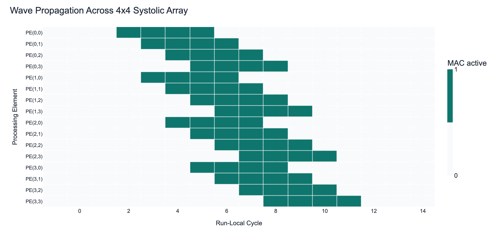
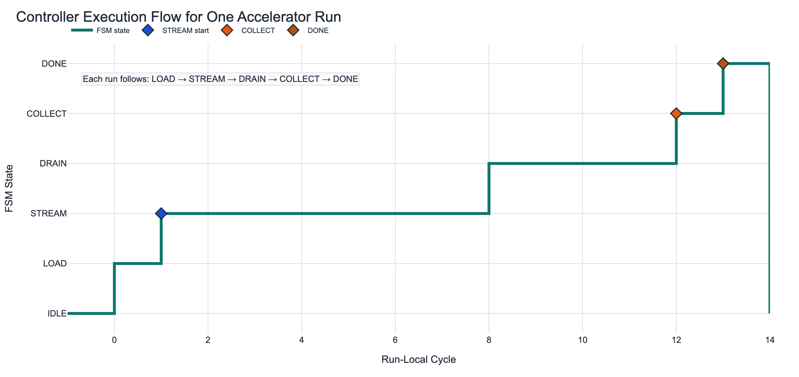
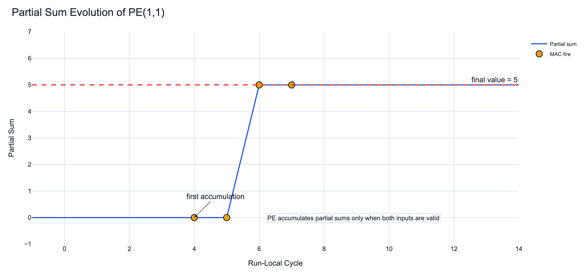
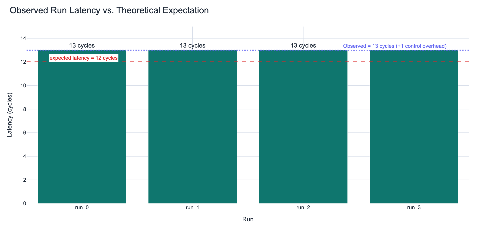

# Systolic Array Accelerator — RTL + Execution Trace

A 4×4 systolic array in Verilog, built for **observability**: every run emits a cycle-level
`trace.csv` that a Python pipeline turns into behavior plots, so the internal dataflow is visible
beyond raw waveforms. A cycle-accurate reference design, not a performance-tuned one.

## Result

Observed latency is **13 cycles vs a theoretical 12** for a 4×4 array; the extra cycle is control
overhead — *measured*, not assumed. Correctness shows up directly in the trace: the per-PE MAC-fire
mask advances diagonally (`0001 → 0013 → 0137 → 137f → 37fe → 7fec → fec8 …`), i.e. the systolic
wavefront sweeping across the array.



MAC activity sweeps diagonally across the 16 PEs — the signature of correct systolic dataflow,
reconstructed from `data/trace.csv`.

| Controller FSM | Partial-sum evolution | Latency |
|---|---|---|
|  |  |  |

FSM: `IDLE → LOAD → STREAM → DRAIN → COLLECT → DONE`. Partial sums accumulate with correct MAC
timing; latency analysis shows the 13-vs-12 overhead.

## Architecture

Matrix A is injected row-wise, B column-wise; data propagates diagonally. Each PE does
`psum += a_in × b_in` and forwards its inputs to neighbors, gated by `enable && a_valid && b_valid`
so only aligned data contributes.

```
rtl/
  pe.v                 MAC + data forwarding, valid-gated
  systolic_array.v     2D PE grid
  controller.v         FSM (IDLE→LOAD→STREAM→DRAIN→COLLECT→DONE)
  input_loader.v · output_collector.v · top.v
tb/
  pe_tb.v · systolic_array_tb.v · top_tb.v   (emit VCD + trace.csv)
python/
  plot_accelerator.py  parses trace.csv → the plots above
data/
  trace.csv            cycle, state, per-PE mac-fire mask, full psum (hex)
```

## Run

```bash
iverilog -g2005 -Wall -o sim tb/top_tb.v rtl/top.v rtl/controller.v \
  rtl/input_loader.v rtl/output_collector.v rtl/systolic_array.v rtl/pe.v
vvp sim                         # → top_tb.vcd + trace.csv
python3 python/plot_accelerator.py   # → results/*.png
```

## Takeaways

- Correct systolic behavior reads as a diagonal wavefront across the array.
- Valid-signal alignment is critical for correct accumulation.
- Control logic adds measurable latency beyond ideal datapath timing (13 vs 12).
- A structured trace makes cycle-level behavior interpretable where raw waveforms don't scale.
